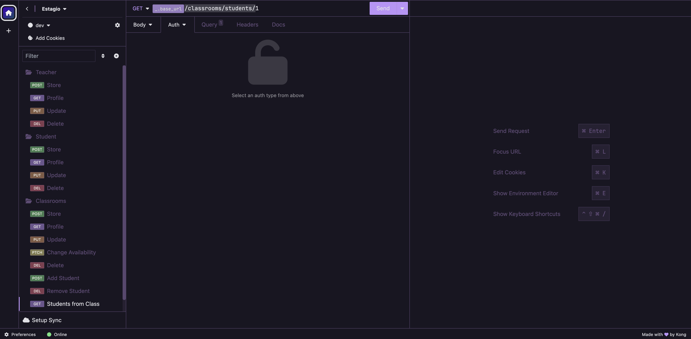

# 📕 Academic API




> Academic API é uma aplicação back-end feita para aprofundar os estudos no framework AdonisJS. Ela possui funcionalidades básicas de gereciamento de professores, alunos e salas de aula.

## 💻 Pré-requisitos

Antes de começar, verifique se você atendeu aos seguintes requisitos:

- Node

## 🚀 Instalando <nome_do_projeto>

Para instalar, siga estas etapas:

Crie um clone do repositório

```
git clone https://github.com/Seiixas/academic-api.git
```

Acesse a pasta e configure o banco de dados:

```bash
cd academic-api
yarn # ou npm install
node ace invoke @adonisjs/lucid
```

Selecione a opção `In the terminal`

Rode as migrations:

```
node ace migration:run
```

Um arquivo de banco de dados será gerado no diretório `tmp/db.sqlite3`.

Finalmente, inicie o servidor:

```
node ace serve --watch
```

## ☕ Usando o Academic API

Por se tratar de um back-end, não há interface gráfica.

📕 Porém, você pode acessar a documentação da API clicando [aqui](DOCS.md).

📘 E o arquivo do Insomnia para importar clicando [aqui](https://gist.githubusercontent.com/Seiixas/f54aa8386191bacbac0d6ffd23c6f721/raw/4aa6797705e670b2d2db012dfb3891ec94f408a1/mateusdev).

## 🧑🏽‍💻 Curiosidades

Este projeto foi utilizado como teste para ingressar na soft house:

[](https://www.spacex.com/)

**Back-end Developer** \
[**ClickSoft**](https://clicksoft.com.br/) • Full-time \
Linguagens & Tecnologias: `AdonisJS`, `LucidORM`, `TypeScript`, `Heroku`, `Google API`, `React`,\
Projetos em destaque: [Rocket](https://www.spacex.com/), [Marte](<https://pt.wikipedia.org/wiki/Marte_(planeta)>)
<br/>

Aprendi toda o framework (AdonisJS) e seu ORM (LucidORM) apenas lendo documentações.
